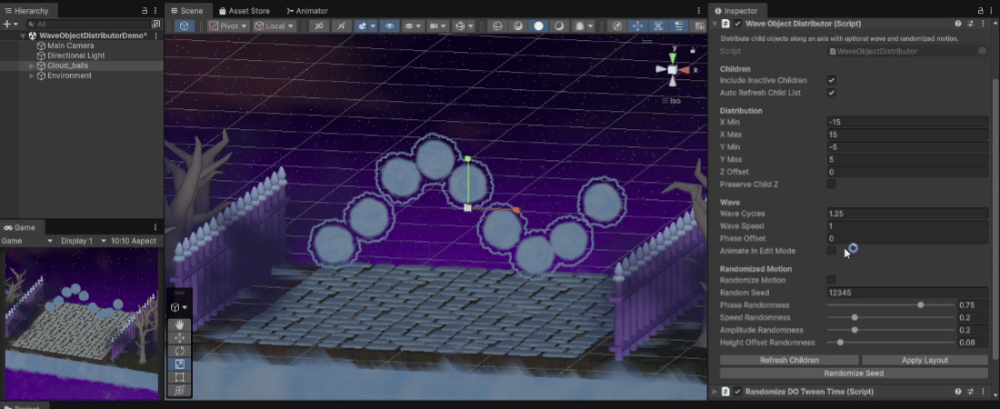
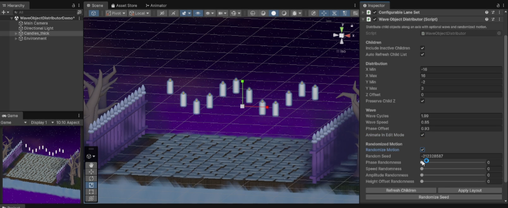
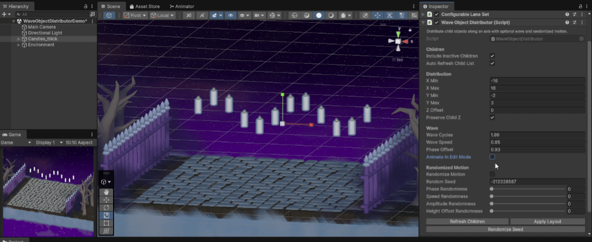

# Wave Object Distributor

Wave Object Distributor is a Unity component and custom Inspector for arranging a parent GameObject's direct children along local X, then applying sine-wave displacement along local Y. It can be used for static Edit Mode layout, optional Edit Mode animation previews, and runtime wave animation in Play Mode.



## Key Features

- Distributes direct child objects along the parent object's local X axis.
- Applies sine-wave displacement along local Y.
- Uses sibling order for distribution order and deterministic per-child variation identity.
- Applies live in Edit Mode through Unity lifecycle and validation callbacks.
- Supports optional continuous Edit Mode animation.
- Animates every frame in Play Mode.
- Adds deterministic seed-based variation for phase, speed, amplitude, and height offset.
- Preserves rotation and scale; only child local positions are modified.
- Includes a lightweight custom Inspector with manual refresh, apply, and seed controls.
- Requires no third-party dependencies.

## Installation

Copy these files into a Unity project:

```text
Runtime/WaveObjectDistributor.cs
Editor/WaveObjectDistributorEditor.cs
```

The editor script must remain inside an `Editor` folder. The runtime script can be placed anywhere outside an `Editor` folder and is safe to include in player builds.

## Usage

1. Add `WaveObjectDistributor` to a parent GameObject.
2. Add the objects you want to distribute as direct children of that GameObject.
3. Adjust the Children, Distribution, Wave, and Randomized Motion settings in the Inspector.
4. Use `Refresh Children`, `Apply Layout`, or `Randomize Seed` when you want to manually update the current setup.

The component is marked `[ExecuteAlways]`. It applies layout during edit-time validation and lifecycle callbacks, so Inspector changes update the layout live in Edit Mode. Continuous Edit Mode animation is controlled by `Animate In Edit Mode`.

In Play Mode, the wave layout animates every frame. There is no separate runtime animation toggle.



## Controls

### Children

- `Include Inactive Children`: includes inactive direct children in the layout.
- `Auto Refresh Child List`: refreshes the cached direct-child list when relevant direct-child hierarchy or active-state changes are detected.

### Distribution

- `X Min`: local X position for the first distributed child.
- `X Max`: local X position for the last distributed child.
- `Y Min`: lower local Y value used by the wave.
- `Y Max`: upper local Y value used by the wave.
- `Z Offset`: local Z value used when `Preserve Child Z` is disabled.
- `Preserve Child Z`: keeps each affected child's current local Z value instead of overwriting it.

### Wave

- `Wave Cycles`: number of sine-wave cycles across the distributed children.
- `Wave Speed`: wave animation speed. Negative values reverse the wave direction.
- `Phase Offset`: phase offset applied to the entire wave.
- `Animate In Edit Mode`: animates the wave continuously in Edit Mode. Runtime animation always runs in Play Mode.

### Randomized Motion

- `Randomize Motion`: enables deterministic per-child phase, speed, amplitude, and height variation.
- `Random Seed`: seed used for deterministic per-child wave variation.
- `Phase Randomness`: varies where each child sits in the wave cycle.
- `Speed Randomness`: varies each child's wave progression speed.
- `Amplitude Randomness`: varies the size of each child's vertical wave motion.
- `Height Offset Randomness`: gives each child a deterministic vertical offset around the wave center.

These variations are deterministic for the same seed, settings, and child order.



### Utility Actions

- `Refresh Children`: rebuilds the cached direct-child list.
- `Apply Layout`: refreshes children and immediately applies the current layout.
- `Randomize Seed`: generates a new deterministic variation seed and reapplies the layout.

## Behavior Notes

- Distribution axis: local X.
- Wave displacement axis: local Y.
- Wave type: sine.
- Affected objects: direct children only.
- Descendants are not traversed recursively.
- Sibling order determines distribution order and per-child variation identity.
- Zero children are a no-op.
- One child is placed at the midpoint of the distribution range.
- The component overwrites affected child local positions while applied.
- Rotation and scale are not modified.
- The tool does not create or generate child objects.
- `Randomize Seed` does not use Unity's global random state.

## Limitations / Scope

- No automatic baseline capture or restore system is included.
- Disabling or removing the component does not restore prior child positions.
- Reordering children changes their distribution order and deterministic variation identity.
- Active/inactive filtering depends on `Include Inactive Children`.
- The tool is intended for direct-child wave layout and animation, not general path placement or object spawning.

## Compatibility

- Tested with Unity `6000.3.15f1`.

## License

MIT License. See `LICENSE`.